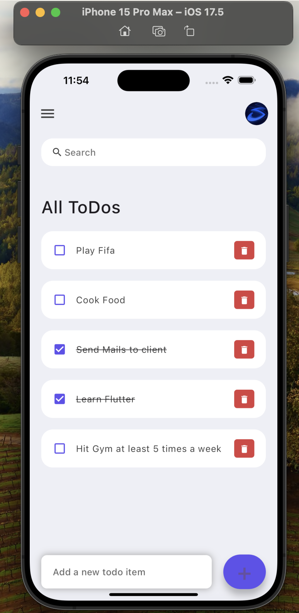

# ToDo-App

A simple and intuitive ToDo application built using Flutter.

## Features

- Add new tasks
- Mark tasks as complete
- Delete tasks
- Persistent storage

## Screenshots



## Installation

To run this project on your local machine, follow these steps:

1. **Clone the repository**
    ```sh
    git clone https://github.com/yourusername/ToDo-App.git
    ```
2. **Navigate to the project directory**
    ```sh
    cd ToDo-App
    ```
3. **Install dependencies**
    ```sh
    flutter pub get
    ```
4. **Run the app**
    ```sh
    flutter run
    ```

## Usage

1. **Add a task**: Use the input field to type in a new task and press the add button.
2. **Complete a task**: Tap on a task to mark it as complete.
3. **Delete a task**: Swipe left on a task to delete it.

